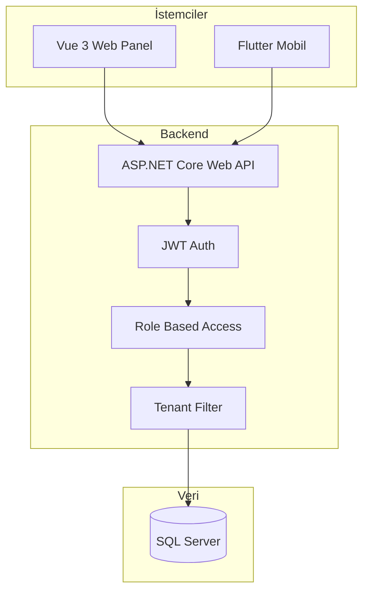

# Vinç Yönetim Sistemi ERP - Geliştirme Planı

SaaS mimarisinde multi-tenant, rol tabanlı erişim kontrolü ile çalışan; ASP.NET Core Web API backend, Vue 3 web panel ve Flutter mobil uygulama içeren tam kapsamlı Vinç Yönetim ERP sistemi geliştirme planı.

---

## Mimari Özet



- **Backend:** `src/backend` (ASP.NET Core 8 Web API)
- **Frontend:** `src/web` (Vue 3 + Vite + Pinia)
- **Mobile:** `src/mobile` (Flutter, Android öncelikli)
- **Ortak:** REST API sözleşmeleri, JWT, tenant bilgisi her istekte header/claim üzerinden

---

## 1. Multi-Tenant ve Veritabanı

**Tenant tablosu:** `Id`, `Name`, `OwnerAdminId`, `CreatedAt`

Tüm iş verisi taşıyan tablolarda **TenantId** (FK) zorunlu. Sorgular:

- Middleware veya `IQueryFilter` (EF Core Global Query Filter) ile otomatik `TenantId = currentTenantId` uygulanacak
- JWT'den `tenantId` claim'i okunup `HttpContext` / `ICurrentTenant` ile kullanılacak
- Hiçbir endpoint başka tenant'ın verisini döndürmeyecek; Admin sadece kendi firmasının verilerini görecek

**Temel tablolar (hepsinde TenantId, gerekli olanlarda soft delete):**  
Users, Roles, Tenants, Firms, Cranes, Operators, Sites, SiteManagers, Jobs, OperatorDailyWorks, Hakedis, Payments, Advances, FuelLogs, MaintenanceRecords, BreakdownReports, MenuItems, RoleMenuPermissions, AuditLog, Notifications, Contracts, Invoices, JobPhotos.

---

## 2. Kullanıcı ve Rol Yapısı

- **Roller:** Admin, Muhasebe, Operatör, Firma (sabit veya seed data)
- **Users:** Email, password hash, RoleId, TenantId, (Operatör/Firma için ilgili OperatorId/FirmId)
- **RoleMenuPermissions:** Hangi rolün hangi menüye erişebileceği (Admin/Muhasebe/Operatör/Firma matrisi gereksinimlerine göre)

RBAC: Her API endpoint'inde `[Authorize(Roles = "Admin,Muhasebe")]` veya policy tabanlı (`RequireRole`) kullanımı; tenant kontrolü ayrı katmanda.

---

## 3. Veritabanı Modelleri (Özet)

| Model                   | Önemli Alanlar                                                                                |
| ----------------------- | --------------------------------------------------------------------------------------------- |
| **Tenants**             | Id, Name, OwnerAdminId, CreatedAt                                                             |
| **Users**               | Id, TenantId, RoleId, Email, PasswordHash, OperatorId?, FirmId?                               |
| **Firms**               | TenantId, Name, Phone, Address, ContactPerson, Email                                          |
| **Cranes**              | TenantId, Plate, Brand, Model, Tonnage, Year, Status (Aktif/Pasif/Bakımda)                    |
| **Operators**           | TenantId, FullName, Phone, Email, LicenseType, CraneId (bağlı vinç)                           |
| **Sites**               | TenantId, FirmId, Name, Address, City, GpsLat, GpsLng                                         |
| **SiteManagers**        | SiteId, FullName, Phone, Email                                                                |
| **Jobs**                | TenantId, FirmId, SiteId, CraneId, OperatorId, StartDate, EndDate, DailyRentPrice             |
| **OperatorDailyWorks**  | JobId, OperatorId, WorkDate, StartTime, EndTime, TotalHours (hesaplanan), OvertimeHours       |
| **Hakedis**             | JobId, Period, TotalDays, DailyRate, TotalAmount, AdvanceDeduction, NetAmount                 |
| **Payments**            | HakedisId / referans, Amount, Date, Type                                                      |
| **Advances**            | TenantId, OperatorId/JobId, Amount, Date                                                      |
| **FuelLogs**            | TenantId, CraneId, Date, Liters, Amount, Description                                           |
| **MaintenanceRecords**  | TenantId, CraneId, MaintenanceDate, Type, ServiceName, Cost                                   |
| **BreakdownReports**    | TenantId, CraneId, OperatorId, Date, Description, Status                                         |
| **MenuItems**           | Id, Name, Route, ParentId, Order                                                             |
| **RoleMenuPermissions** | RoleId, MenuItemId                                                                            |
| **AuditLog**            | TenantId, UserId, Action, EntityType, EntityId, OldValues (JSON), NewValues (JSON), CreatedAt |
| **Notifications**      | TenantId, UserId, Title, Body, IsRead, CreatedAt, Type (Info/Alert/Job/Breakdown/Payment)      |
| **Contracts**           | TenantId, FirmId, JobId?, ContractNo, StartDate, EndDate, DocumentPath (PDF), CreatedAt       |
| **Invoices**            | TenantId, HakedisId, FirmId, InvoiceNo, Amount, IssueDate, DueDate, Status, PdfPath           |
| **JobPhotos**           | JobId, FilePath, UploadedBy (OperatorId), UploadedAt                                          |

**Soft delete:** Tüm ana entity'lerde (Firms, Cranes, Operators, Sites, Jobs vb.) `IsDeleted` (bool), `DeletedAt` (DateTime?), `DeletedBy` (UserId?) alanları bulunacak. Listeleme ve raporlarda varsayılan `IsDeleted == false` filtresi uygulanacak; silinen kayıtlar yalnızca audit/geri getirme için saklanacak.

Yevmiye: **OperatorDailyWorks** ile; mesai 8 saat üzeri **OvertimeHours** alanında tutulacak.

---

## 4. API Yapısı

- **Base URL ve sürüm:** `/api/v1` — İleride v2'ye geçiş için API sürümü URL'de tutulacak.
- **Sağlık kontrolü:** `GET /health` (canlılık), `GET /health/ready` (DB bağlantısı dahil) — monitoring ve container orchestration için.
- **Auth:** `POST /api/v1/auth/login` (email, password) → JWT (içinde tenantId, userId, role); `POST /api/v1/auth/forgot-password`, `POST /api/v1/auth/reset-password` (token + yeni şifre).
- **Dashboard:** `GET /api/v1/dashboard` — Rol bazlı tek endpoint; response içinde `stats`, `charts`, `activeJobs` vb. rol için anlamlı veriler.
- **CRUD örnekleri:**  
`/api/v1/cranes`, `/api/v1/operators`, `/api/v1/firms`, `/api/v1/sites`, `/api/v1/jobs`, `/api/v1/hakedis`, `/api/v1/fuel`, `/api/v1/maintenance`, `/api/v1/breakdowns`, `/api/v1/advances`, `/api/v1/payments`, `/api/v1/contracts`, `/api/v1/invoices`, `/api/v1/notifications`.
- **Raporlar:** `/api/v1/reports/crane-usage`, `/api/v1/reports/operator-performance`, `/api/v1/reports/firm-jobs`, `/api/v1/reports/income`, `/api/v1/reports/fuel`.
- **Mobil:** İş başlat/bitir, QR doğrulama, GPS doğrulama, yevmiye, arıza, fotoğraf için özel endpoint'ler (örn. `POST /api/v1/jobs/{id}/start`, `POST /api/v1/jobs/{id}/end`, `POST /api/v1/jobs/{id}/photos`, `POST /api/v1/breakdowns`).

Tüm listeleme ve detay sorguları backend'de **TenantId** ile filtrelenecek.

---

## 5. İş Kuralları (Özet)

- **Yevmiye:** OperatorDailyWorks.StartTime/EndTime → Toplam süre otomatik (EndTime - StartTime); 8 saat üstü mesai alanına yazılacak.
- **Hakediş:** Toplam = Günlük kira × çalışma günü; avans düşülerek net hakediş.
- **Vinç doluluk:** (Toplam çalışma günü / dönemdeki toplam gün) × 100; dashboard'da grafik.
- **QR ile iş başlatma:** Şantiye için unique QR (siteId/tenantId içeren); mobil uygulama QR'ı okutunca ilgili job'ı başlatır.
- **GPS doğrulama:** İş başlatma/bitirme sırasında operatör konumu ile şantiye koordinatı arası mesafe ≤ 200m kontrolü (Haversine veya benzeri).

---

## 6. Backend (ASP.NET Core) Yapısı

- **Klasörler:** `Controllers`, `Services`, `Repositories`, `Models`, `Entities`, `DTOs`, `Middleware` (tenant, exception), `Filters` (tenant scope).
- **Paketler:** EF Core, SQL Server, JWT Bearer, Swashbuckle (Swagger), FluentValidation (opsiyonel).
- **Tenant:** JWT'den tenantId alan middleware; `ICurrentTenant` ile servislerde kullanım; EF Core global query filter.
- **Auth:** JWT üretimi (login), refresh token istenirse ayrı tablo ve endpoint eklenebilir.
- **Dashboard:** `DashboardService` tek `GET /api/dashboard` endpoint'inde rolüne göre farklı veri seti döner (admin: vinç/firma sayısı, aylık gelir, yakıt, bakım; muhasebe: hakediş/ödeme/avans; operatör: bugünkü iş; firma: kiralanan vinçler, hakediş özeti).

---

## 7. Web Panel (Vue 3 + Vite + Pinia)

- **Router:** Rol bazlı route guard; menü `RoleMenuPermissions` veya sabit rol-menü eşlemesi ile.
- **Pinia:** Auth store (user, token, tenantId, role), genel state'ler.
- **Sayfalar:** Dashboard, Firmalar, Vinçler, Operatörler, Şantiyeler, İş Planlama, Hakediş, Yevmiye, Bakım, Yakıt, Arıza Bildirimleri, Ödemeler, Avanslar, Raporlar, Kullanıcı Yönetimi, Sistem Ayarları — sadece yetkili rollere görünür.
- **Özellikler:** CRUD formları, tablolarda filtreleme (tarih, firma, vinç vb.), grafikler (Chart.js veya benzeri), tutarlı UI (ör. Vue 3 + Vite + bir component kütüphanesi).

---

## 8. Mobil Uygulama (Flutter)

- **Hedef:** Android öncelikli; iOS da hedeflenebilir.
- **Ekranlar:** Login, Dashboard (bugünkü iş), İş Listesi, İş Başlat (QR + GPS), İş Bitir, Yevmiye listesi, Arıza bildirimi, Fotoğraf yükleme, Profil.
- **QR:** `mobile_scanner` veya `qr_code_scanner` ile şantiye QR'ı okutma → API'ye job + site bilgisi gönderimi.
- **GPS:** `geolocator` ile konum; iş başlat/bitirde API'ye koordinat gönderimi; backend'de 200m kontrolü.
- **Fotoğraf:** `image_picker`; multipart `POST /api/jobs/{id}/photos` ile yükleme.
- **Auth:** Token saklama (secure_storage), isteklerde Authorization header.

---

## 9. Dosya Yükleme ve Depolama

- Operatör fotoğrafları: Backend'de dosya sistemi veya blob storage (ör. wwwroot/uploads veya Azure Blob); kayıtlar `JobPhotos` tablosu (JobId, FilePath, UploadedAt) ile tutulabilir.
- API: `POST /api/jobs/{id}/photos` (multipart/form-data).

---

## 10. Raporlar

- Vinç kullanım raporu, operatör performans, firma iş raporu, gelir raporu, yakıt gider raporu: Hepsi tenant bazlı, tarih aralığı parametreli API endpoint'leri; web panelde filtre + tablo/grafik export (Excel/PDF istenirse sonra eklenebilir).

---

## 11. Test Stratejisi

- **Backend:** xUnit ile unit test (servisler, hakediş/mesai hesaplamaları); integration test (API + in-memory SQL veya test DB) tenant izolasyonu ve yetki kontrolü için.
- **Frontend:** Cypress ile kritik akışlar (login, dashboard, bir CRUD akışı).
- **Mobile:** Flutter test (widget test + integration test) login ve iş başlatma akışı için.

---

## 12. Güvenlik

- **JWT:** Access token süresi makul (örn. 1–2 saat); gerekirse refresh token.
- **Rol kontrolü:** Her endpoint'te `[Authorize(Roles = "...")]` veya policy.
- **Tenant izolasyonu:** Tüm sorgularda TenantId; başka tenant'ın Id'si ile istek yapılsa bile veri dönülmemesi.
- **HTTPS:** Production'da zorunlu.
- **Şifre:** BCrypt veya ASP.NET Identity PasswordHasher.
- **Şifre sıfırlama:** "Şifremi unuttum" akışı — token'lı link (örn. 1 saat geçerli), e-posta ile gönderim; `POST /api/v1/auth/forgot-password` (email), `POST /api/v1/auth/reset-password` (token, newPassword). İsteğe bağlı: şifre güç politikası (min uzunluk, büyük/küçük harf, rakam).

---

## 13. Dokümantasyon ve Çalıştırma

- **Swagger:** Swashbuckle ile `/swagger`; JWT Bearer tanımlı; tüm endpoint'ler dokümante.
- **Tek komutla çalıştırma:**  
  - **Backend:** `dotnet run` (src/backend).  
  - **Frontend:** `npm run dev` (src/web).  
  - **Mobile:** `flutter run` (src/mobile).  
  Root'ta `README.md` ve opsiyonel `docker-compose.yml` ile (MSSQL + API) tek komutla ortam ayağa kaldırılabilir.

---

## 14. Denetim (Audit Log)

- **AuditLog** tablosu: TenantId, UserId, Action (Created/Updated/Deleted), EntityType, EntityId, OldValues (JSON), NewValues (JSON), CreatedAt.
- Hakediş, ödeme, avans, kullanıcı/rol değişikliği, firma/vinç/operatör CRUD gibi hassas işlemlerde kayıt atılacak.
- Servis katmanında (örn. `IAuditService`) değişiklik öncesi/sonrası serialize edilip yazılacak; listeleme endpoint'i sadece yetkili roller (Admin/Muhasebe) için açılacak.

---

## 15. Bildirimler

- **Notifications** tablosu: TenantId, UserId, Title, Body, IsRead, CreatedAt, Type (Info/Alert/Job/Breakdown/Payment).
- Kullanım örnekleri: Operatöre yeni iş atandı; firmaya ödeme alındı / hakediş onayı; Admin'e arıza bildirimi veya bakım tarihi yaklaştı.
- Web panelde bildirim listesi ve "okundu" işaretleme; API: `GET /api/v1/notifications`, `PATCH /api/v1/notifications/{id}/read`. İleride mobil push (FCM) eklenebilir; ilk aşamada e-posta ile kritik bildirimler (arıza vb.) gönderilebilir.

---

## 16. Fatura ve Sözleşme

- **Contracts:** Kira sözleşmesi (FirmId, JobId, ContractNo, tarihler, PDF yolu); yükleme endpoint'i ve listeleme.
- **Invoices:** Hakediş sonrası fatura (HakedisId, FirmId, InvoiceNo, Amount, IssueDate, DueDate, Status, PdfPath); fatura oluşturma (PDF üretimi veya manuel yükleme) ve listeleme.
- İş (Job) tarafında ileride genişletme: mesai ücreti, minimum kiralama süresi, sözleşme no gibi alanlar veya ContractId FK eklenebilir.

---

## 17. E-posta Altyapısı

- SMTP veya sağlayıcı (SendGrid, AWS SES vb.) ile e-posta gönderimi.
- Kullanım: şifre sıfırlama linki, hesap aktivasyonu (isteğe bağlı), kritik uyarılar (arıza bildirimi, bakım hatırlatması).
- Backend'de `IEmailService` ve template'ler (örn. Razor veya basit string template); ayarlar appsettings'te (SMTP, gönderen adresi).

---

## 18. Tenant Onboarding

- **Akış netleştirmesi:** Yeni vinç firması (tenant) nasıl sisteme girecek?
  - **Seçenek A:** Süper admin (sistem yöneticisi) tek tenant oluşturabilir; her tenant'ın ilk kullanıcısı Admin olarak atanır.
  - **Seçenek B:** Self-registration ile tenant kaydı (onay süreci isteğe bağlı).
- Plan: En azından Süper Admin ile tenant + OwnerAdminId atanmış ilk kullanıcı oluşturma; self-service ileride eklenebilir. Tenants tablosunda OwnerAdminId ile ilk admin bağlantısı tutulacak.

---

## 19. Loglama ve İzleme

- **Yapılandırılmış loglama:** Serilog (veya NLog) ile JSON/tek satır log; istek bazlı CorrelationId (middleware ile header'dan veya yeni üretim).
- **Hata toplama:** Production'da Sentry veya benzeri entegrasyon (opsiyonel); hata logları merkezi toplanacak.
- **Rate limiting:** Login ve hassas endpoint'lerde istek sınırı (örn. AspNetCoreRateLimit) ile kötüye kullanım önleme.

---

## 20. Mobil Çevrimdışı (Offline) Desteği — Faz 2

- Operatör şantiyede internet zayıf olabilir; yevmiye girişi ve arıza bildirimi çevrimdışı kaydedilip sonra senkronize edilebilir.
- Flutter tarafında yerel veritabanı (SQLite/Hive) ile offline kuyruk; bağlantı gelince `POST /api/v1/sync` veya ilgili endpoint'lere toplu gönderim; sunucu çakışma ve duplicate'e karşı idempotency key kullanabilir.
- Plan'da Faz 2 / iyileştirme olarak not edilir; ilk sürümde online-first yeterli.

---

## 21. Sözleşme / Kira Koşulları (İş Genişletmesi)

- Job entity'sine ileride eklenebilecek alanlar: ContractId (FK), OvertimeRate (mesai ücreti), MinRentalDays, ContractNo; veya ayrı **Contract** tablosu ile Job–Contract ilişkisi.
- Veri modeli bu genişlemeye uygun tutulacak (Contract tablosu plana alındı; Job'a ContractId eklenmesi opsiyonel).

---

## Önerilen Proje Ağacı (Özet)

```
vinc-yonetimi/
├── src/
│   ├── backend/                    # ASP.NET Core Web API
│   │   ├── Controllers/
│   │   ├── Services/               # Auth, Dashboard, Audit, Email, Notification
│   │   ├── Data/                   # DbContext, Entities
│   │   ├── DTOs/
│   │   ├── Middleware/             # Tenant, Exception, CorrelationId
│   │   └── ...
│   ├── web/                        # Vue 3 + Vite + Pinia
│   │   ├── src/
│   │   │   ├── views/
│   │   │   ├── components/
│   │   │   ├── stores/
│   │   │   └── router/
│   │   └── ...
│   └── mobile/                     # Flutter
│       ├── lib/
│       │   ├── screens/
│       │   ├── services/
│       │   └── ...
│       └── ...
├── docs/                           # API ve mimari notları (opsiyonel)
└── README.md
```

---

## Uygulama Sırası Önerisi

1. **Backend temel:** Solution, DbContext, Tenant + User + Role modelleri, migration, JWT login, tenant middleware ve global filter; `/health`, `/health/ready`; API base `/api/v1`.
2. **Soft delete ve Audit:** Ana entity'lere IsDeleted/DeletedAt/DeletedBy; AuditLog entity ve IAuditService; hassas işlemlerde audit kaydı.
3. **Şifre sıfırlama ve e-posta:** IEmailService, forgot-password / reset-password endpoint'leri, token üretimi ve saklama (örn. User tablosunda veya PasswordResetTokens).
4. **Tüm entity'ler ve CRUD API'leri:** Firms, Cranes, Operators, Sites, Jobs, OperatorDailyWorks, Hakedis, Fuel, Maintenance, Breakdowns, Advances, Payments, Notifications, Contracts, Invoices, JobPhotos; hepsinde tenant + rol kontrolü + soft delete (uygun olanlarda).
5. **Bildirimler:** Oluşturma (iş/ödeme/arıza tetikleyicileri), listeleme ve okundu işaretleme API + web panel bildirim alanı.
6. **Dashboard API:** Tek endpoint, rol bazlı veri; isteğe bağlı kısa süreli cache (memory/Redis).
7. **Web panel:** Auth, router guard, layout, menü (rol bazlı), dashboard, CRUD sayfaları, grafikler, rapor sayfaları, bildirim bileşeni, Fatura/Sözleşme sayfaları.
8. **Mobil:** Auth, iş listesi, iş başlat/bitir (QR + GPS), yevmiye, arıza, fotoğraf; API entegrasyonu.
9. **Tenant onboarding:** Süper admin veya seed ile tenant + ilk admin oluşturma akışı.
10. **Raporlar ve rapor API'leri.**
11. **Loglama (Serilog, CorrelationId) ve rate limiting;** opsiyonel Sentry.
12. **Testler ve Swagger süsleme.**
13. **Faz 2:** Mobil offline senkronizasyon; FCM push bildirimleri.

Bu plan, 30 ana madde ile birlikte audit log, soft delete, bildirimler, fatura/sözleşme, şifre sıfırlama, e-posta, tenant onboarding, loglama/izleme, API sürümü ve health check, mobil offline taslağını kapsar.
